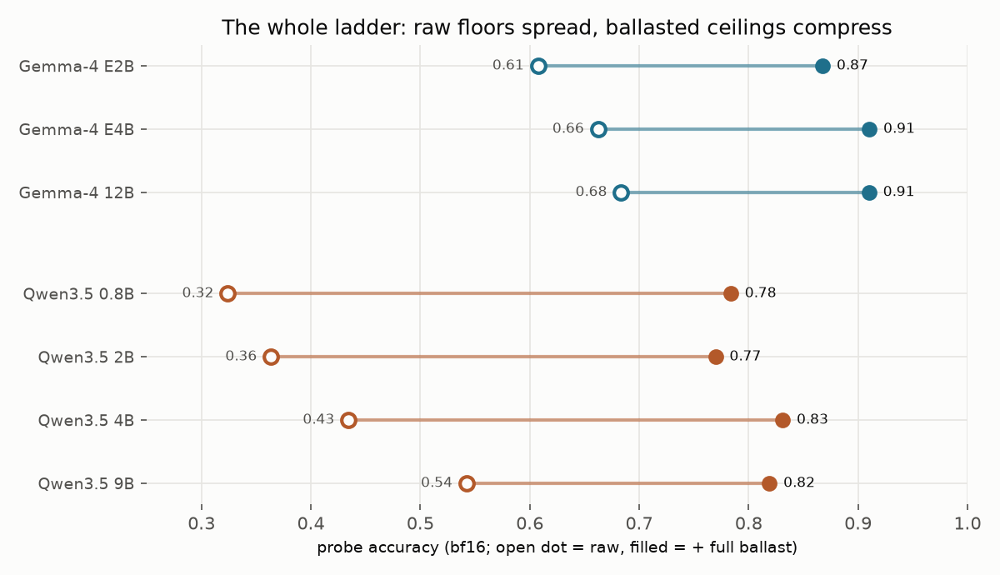

# ⚓ OpenBallast

## TL;DR

We measured how much of a bigger model's factual advantage is just memorized
trivia, and whether you can buy that back with a file instead of with
parameters. You can, and it's 40–100× cheaper per byte.

On 50,147 factual questions plus a 43,000-probe hallucination suite, across
two model families:

- A 2B model with a 470 MB fact file beside it beats a 12B model on its own,
  measured with a real lookup in the loop, not an idealized one. The same
  accuracy bought with parameters costs ≈19 GB of weights at full precision,
  or ≈7 GB at the kindest quantization that doesn't damage the 12B. Still
  ≈15× more bytes.
- From memory alone, a 2B / 4B / 12B from one family score 61 / 66 / 68%.
  Give all three the same file to look facts up in and they land at
  87 / 91 / 91%. The factual gap between model sizes is mostly memorization,
  and memorization is cheap to ship.
- Those are multiple-choice scores. Measured open-ended, with real
  retrieval over the prose tier: 0.154 → 0.331 on open-domain questions,
  against a 0.681 ceiling with perfect evidence. Far lower everywhere; if
  you are deciding whether to run the proxy, these are the numbers to
  decide on.
- Made-up answers drop from 24% to 7%. But on questions with *no* true
  answer, evidence makes fabrication worse (24% → 41%). This fixes answerable
  questions; it does not teach abstention.
- 4-bit quantization breaks some models and not others, and size won't
  predict which. Accuracy *with* evidence is the test that tells you which
  case you have.
- Building each model a personalized corpus of its own blind spots loses to
  one generic corpus, every time, at every size.

The knowledge ships as a static, versioned, auditable file: offline forever,
rebuilt from public dumps, swapped without retraining anything.

So go ahead. Download more VRAM.

## How to

Two jobs bring most people here: **diagnose quantization damage** (is this
Q4 file broken, or just forgetful?) and **ballast a model for local use**
(make a small model factually competitive with a big one). Everything is
CPU-side except the model you already run. The CLI: `uvx openballast` (or
`pip install openballast`; source at
[ballast-cli](https://github.com/OpenBallast/ballast-cli)).

Both jobs start with the corpus:

```bash
uvx openballast pull --level 3     # 275 MB download, ~1 GB on disk
```

`pull` downloads [ballast-t0](https://huggingface.co/datasets/OpenBallast/ballast-t0),
the reference corpus built from Wikidata: 25.4M entities as compact fact
records, in SQLite serving form. `--level` picks how much of it, L0 (54 MB,
the most-cited entities) up to L7 (2.3 GB, all of them). The prose tiers
(t1, t2) are parquet datasets for now, not `pull` targets; for your own
documents there's `ballast build` below.

### 1. Diagnose quantization damage

Quantization hurts models in two distinguishable ways, and raw benchmarks
can't tell them apart: a **forgetful** model lost recall (evidence gives it
back), a **damaged** model lost the ability to read (no corpus helps).
Grounded accuracy separates the cases. Run the three-arm benchmark on the
quant you downloaded and on a known-good reference:

```bash
ballast eval -m qwen3.5:4b-q4_K_M --limit 200 --outdir eval_q4
ballast eval -m qwen3.5:4b-q8_0   --limit 200 --outdir eval_q8
```

Each run takes a few minutes on a 16 GB desktop card. What came back on
ours, Qwen3.5-4B q4_K_M against q8_0 (llama.cpp upstream, thinking
disabled, 200 probes at corpus level L3):

```
three-arm instrument: 200 probes, model qwen3.5:4b-q4_K_M, corpus level L3
U 0.3450  R 0.4000  S 0.4750
knowledge-limited band +0.1300; delivery ratio 0.423

three-arm instrument: 200 probes, model qwen3.5:4b-q8_0, corpus level L3
U 0.3500  R 0.3800  S 0.4800
knowledge-limited band +0.1300; delivery ratio 0.231
```

This is the healthy case: U held (0.345 vs 0.350) and S held (0.475 vs
0.480), so q4_K_M costs this model nothing measurable on recall or on
reading. The R difference is sampling noise at n = 200. The two failure
signatures to look for:

- **U dropped but S held** (ungrounded down, evidence-in-hand accuracy
  intact): the quant is merely forgetful. Ballast it and carry on.
- **S collapsed too** (the model can't convert evidence into answers
  anymore): reading is damaged and no corpus buys it back. Use a bigger
  quant. In our sweep the cliff sat between Q6_K and the 4-bit formats, and
  Q6_K was free on every model measured.

One practical trap: if your model has a thinking mode, disable it for the
eval (llama.cpp: `--reasoning-budget 0` plus
`--chat-template-kwargs '{"enable_thinking":false}'`; other runtimes have
equivalents). A thinking model burns its token budget on reasoning, the
extracted answers come back empty, and every arm reads near zero. We
measured exactly that before disabling it: the same q4_K_M scored
U 0.185 / S 0.215 with thinking on and truncated, U 0.345 / S 0.475 with
it off.

**How this differs from KL-divergence.** The standard quant check (llama.cpp's
`--kl-divergence`, perplexity deltas) measures how far the quant's token
distributions drift from the full-precision model's, averaged over generic
text. That is a *fidelity* number: it says the outputs changed, not which
capability broke. It also needs the full-precision reference loaded
alongside, and at 12B+ that is exactly the model you couldn't run. The
grounded readout is *functional*: U isolates recall, S isolates reading, and
the two fail independently. In our sweep one model quantized to
recall-intact/reading-damaged and another to the reverse; a single drift
scalar can't tell those apart. KL asks "did quantization change this model?"
This asks "can I ship facts to fix it, or is the reader broken?"

Which models cliff, why parameter count won't predict it, and the full
sweep: [results-quantization](docs/results-quantization.md).

One instrument note, because it matters. `ballast eval` is the *deployment*
instrument: open-ended generation through your own runtime, graded by
answer containment. The tables in [The numbers](#the-numbers) come from a
different instrument, logprob multiple choice in our research harness,
which is not public ([methodology](docs/methodology.md)). Same U/R/S
decomposition, different measurement: generative scores land far lower,
and a CLI run cannot land on any figure in this README even in principle.
Compare your two summaries with each other, nothing else.

### 2. Ballast a model for local use (one more command)

```bash
uvx openballast serve              # grounding proxy :11435 + MCP :11436
```

Point your client at `http://localhost:11435/v1` instead of `:11434`. That's
the whole setup. Every chat request gets relevant facts prepended before your
model sees it; streaming and everything else passes through untouched.

First live A/B on a 0.5B model, asked "Where was Douglas Adams born?" On its
own: *Dublin*. Through the proxy: *Cambridge*.

**Unanswerable questions, measured on both instruments.** On questions with
no true answer (false premises, facts nobody recorded), our research
protocol found injected evidence makes fabrication *worse* under calibrated
abstention: 24% → 41%, rising with corpus coverage
([results-hallucination](docs/results-hallucination.md)). The deployment
picture is different: a raw chat model simply answers false premises
(fabrication 0.92 on 150 unanswerable probes from the public evalsets,
qwen3.5:4b-q4_K_M), grounding drops that to 0.08, and the answerability
warn line the proxy ships since v0.2.2 drops it again to 0.03, with
answerable-probe accuracy unchanged (0.300 both arms, n = 150). Same
corpus, different instruments, different signs; both are real. The guard
is one sentence of system prompt (warn, never suppress), and the residual
failure mode remains: evidence about the right entity can still read as
license to answer.

### Plug into MCP clients

Claude Desktop, LM Studio, Cline, Goose. Add:

```json
{ "ballast": { "command": "uvx", "args": ["openballast", "mcp"] } }
```

The server exposes `resolve`, `evidence`, and `lookup`, identical to the
hosted demo endpoint.

### Pick a knowledge size

Levels nest like weight quants: L0 (54 MB download) through L7 (2.3 GB,
everything). `pull --level 5` after `--level 3` fetches only the new buckets.
The value curve is steep at the start (the first 100 MB is worth ≈14× the
last 100 MB), so small levels buy most of the benefit. Sizes:
[ballast-t0 card](https://huggingface.co/datasets/OpenBallast/ballast-t0).

### Bring your own corpus

```bash
ballast build ./handbook --name handbook
ballast lookup --corpus handbook "What is our deploy freeze policy?"
ballast serve  --corpus handbook
```

A directory of `.md`/`.txt` files (or parquet with a `text` column) becomes a
servable corpus: documents are addressed by title, chunked into atomic
passages, and everything (`serve`, `lookup`, `mcp`) works against it
unchanged. An optional `rank` column (0..1) spreads documents across nested
levels; without it the level knob is a no-op.

### Profile your model

```bash
ballast profile -m qwen3.5:9b --limit 2000 --budget 2GB
```

Probes the model ungrounded through your OpenAI-compatible upstream (Ollama,
LM Studio, llama.cpp, vLLM; the CLI never loads weights), reports accuracy
per corpus region from head to tail, and writes a grounding competence
profile (`.gcp.json`) with a reliability AUC. Given a byte budget, it
recommends the corpus level where grounding still buys accuracy for *this*
model.

### Measure what grounding delivers

```bash
ballast eval -m qwen3.5:9b --limit 500
```

Every probe is asked three ways: ungrounded (U), with realized retrieval
(R), and with oracle-entity evidence (S). The headline output is the
delivery ratio (R − U) / (S − U): the fraction of the reachable knowledge
gap your retrieval closes. Arms checkpoint to parquet and resume after
interruption.

### Query the data directly

All four artifacts are plain hive-partitioned parquet on Hugging Face:

| artifact | what | license |
|---|---|---|
| [ballast-t0](https://huggingface.co/datasets/OpenBallast/ballast-t0) | 25.4M entities, 197M Wikidata facts, levels L0–L7 | CC0 |
| [ballast-t1](https://huggingface.co/datasets/OpenBallast/ballast-t1) | 37.4M full-body Wikipedia passage chunks, same levels | CC BY-SA (+CC0 sidecar) |
| [ballast-t2](https://huggingface.co/datasets/OpenBallast/ballast-t2) | 61 OpenStax textbooks as passages, git-SHA-pinned | CC BY |
| [ballast-evalsets](https://huggingface.co/datasets/OpenBallast/ballast-evalsets) | 50k recall probes + 43k hallucination probes | mixed, per source |

```sql
SELECT t.qid, p.label AS prop, t.value
FROM read_parquet('ballast-t0/triples/**/*.parquet', hive_partitioning=true) t
JOIN read_parquet('ballast-t0/properties.parquet') p USING (pid)
WHERE t.rank_bucket <= 3 AND t.qid = 'Q42';
```

### Or try it with nothing installed

```bash
curl "https://mcp.openballast.org/lookup?question=Where+was+Douglas+Adams+born%3F&level=5"
```

Demo-grade (free tier, no SLA); reference in [docs/mcp.md](docs/mcp.md). The
real downloads live on Hugging Face.

## Why it works

A language model is two things fused together: an engine that can reason and
read, and an encyclopedia it memorized at training time. Most of what you buy
with a bigger model is the encyclopedia, and parameters are the most
expensive place to store facts. Ballast splits them: the facts ship as a
plain file next to the model, sized like a quant, updated by swapping the
file.

The objections, measured:

- **"Small models are dumb."** They're *ignorant*. Gemma-4-E2B scores 61%
  from memory and 87% when handed a short evidence block. The engine was
  always capable; it never had room to store the facts.
- **"It makes things up."** Grounding cuts hallucination 24% → 7% on that
  model, and 3–20× on two-hop questions where no single line contains the
  answer. The limit: on unanswerable questions (false premises, facts
  nobody recorded), evidence *raises* fabrication; a page about the right
  person reads as permission to answer
  ([results-hallucination](docs/results-hallucination.md)).
- **"Can it notice when it's wrong?"** Sometimes, cheaply: a string test
  checks whether the answer is supported by the evidence it saw; unsupported
  answers get one retry against a recall-first pack. +4.30 points on the
  development population, +3.62 held-out, and it almost never breaks a
  correct answer. It cannot catch answers that are supported *and* wrong
  ([results-retrieval](docs/results-retrieval.md)).
- **"My GPU only has 8/12/16 GB."** The file sits on disk, not in VRAM. The
  whole two-model demo runs on one 16 GB desktop card.
- **"The model's knowledge is stale."** Weights learn only at training time;
  the corpus rebuilds from public dumps. Swap a file, retrain nothing.
- **"We can't send data to anyone's API."** This is a static file. Carry it
  across the air gap once; the knowledge layer works offline forever, and
  you can audit exactly what the model has access to.
- **"Serving is too expensive."** A 2B engine matching a 12B on factual work
  is 6× fewer parameters per token, with one shared knowledge file per
  cluster instead of a copy in every GPU's weights.

**Isn't this just RAG?** Mechanically yes: look something up, put it in the
prompt. Three differences. The knowledge comes in *sizes* (a measured
knowledge-per-byte dial, not a vector database you maintain). It's *one
public versioned file* anyone can pin or diff. And the finding is an
*exchange rate*: how many corpus bytes buy what a parameter byte buys
(40–100× at full precision, ≈15× against the cheapest intact quant).
"Retrieval helps" isn't news; the price of a fact is.

## The numbers

Two regimes, stated up front. The tables below are 8-way multiple choice
read from token probabilities with an abstain option, from our research
harness (not the CLI; [methodology](docs/methodology.md)). They isolate
recall vs reading; they are not deployment accuracy. The deployment-shaped
measurement is open-ended generation with real retrieval, and it is much
lower: Qwen3.5-9B-Base went 0.154 raw → 0.289 with one-pass retrieval →
0.331 with a verify-and-retry second pass, against a 0.681 oracle-evidence
ceiling ([results-retrieval](docs/results-retrieval.md)). Both regimes
show the same structure; only the multiple-choice one shows it this
cleanly. Full tables: [results-equal-bytes](docs/results-equal-bytes.md).



| model | on its own | with the full 1.5 GB file | made-up answers |
|---|---|---|---|
| Gemma-4-E2B | 61% | **87%** | 24% → **7%** |
| Gemma-4-E4B | 66% | **91%** | 20% → 4% |
| Gemma-4-12B | 68% | **91%** | 21% → 5% |

| model | on its own | with the full 1.5 GB file | made-up answers |
|---|---|---|---|
| Qwen3.5-0.8B | 32% | **78%** | 60% → **11%** |
| Qwen3.5-2B | 36% | 77% | 55% → 14% |
| Qwen3.5-4B | 43% | **83%** | 47% → **10%** |
| Qwen3.5-9B | 54% | 82% | 33% → 11% |

Raw floors spread; grounded ceilings compress. The **ballasted 4B edges
past the ballasted 9B**. What separates model sizes factually is mostly
memorization, and that part is cheap to buy back.

**The lookup is real, and priced in.** Headline tables usually assume perfect
entity resolution. We built a deliberately simple linker (no embeddings, no
model calls) and measured it: it delivers about two thirds of the ideal
benefit, and the crossings quoted here (470 MB to beat the raw 12B) already
include that. A wrong lookup turned out nearly harmless (the model ignores
irrelevant facts), so recall, not precision, is what pays
([results-retrieval](docs/results-retrieval.md)).

**If you run quantized models:** 4-bit breaks some models and not others.
E4B collapses (66% → 49% raw, 91% → 65% grounded) while E2B and 12B barely
move, on both nf4 and GGUF Q4_K_M; Q6_K was free on every model measured.
Grounded accuracy is the diagnostic: a forgetful model recovers when handed
evidence, a damaged one doesn't
([results-quantization](docs/results-quantization.md)).


The same sweep on Qwen3.5 shows the other outcome: no cliff anywhere. Raw
floors and grounded ceilings stay flat from bf16 down to nf4 (worst ceiling
loss 5.6 points against E4B's 26). The catastrophic mode belongs to
particular models, not to 4-bit itself. Test your quant; don't trust the
format:


**The thing that didn't work:** per-model personalized corpora. We can
predict a model's blind spots from corpus features (AUC ≈ 0.8), and families
genuinely differ. Generic selection still won at every equal-bytes level. The
corpus can tell you what a model doesn't know; it cannot tell you what people
will ask ([results-boost](docs/results-boost.md)).

## Docs

- [THESIS.md](THESIS.md): the research overview, headline numbers, every
  caveat
- [docs/results-equal-bytes.md](docs/results-equal-bytes.md): accuracy
  ladders and the corpus-vs-parameters exchange rate
- [docs/results-quantization.md](docs/results-quantization.md): quantization
  vs recall vs reading; the Q6_K verdict
- [docs/results-boost.md](docs/results-boost.md): the personalized-corpus
  negative result
- [docs/results-hallucination.md](docs/results-hallucination.md): where
  grounding cuts hallucination and where it raises fabrication
- [docs/results-retrieval.md](docs/results-retrieval.md): the real-lookup
  measurement and the two-pass support check
- [docs/methodology.md](docs/methodology.md): probes, composition trick,
  registered bands
- [docs/artifact.md](docs/artifact.md): corpus layout and loading
- [docs/mcp.md](docs/mcp.md): demo endpoint reference

## Roadmap

- **License as a first-class knob.** The tiers now span CC0 (T0), CC BY-SA
  (T1), and CC BY (T2), tracked per record; the remaining step is choosing a
  license policy at download time ("commercial-safe, no share-alike") and
  getting an artifact that satisfies it.
- **Bring-your-own-corpus as a contract.** `ballast build` ships; next is
  publishing the artifact format and loader contract so anyone can build a
  ballast with none of our tooling in the loop.
- **Keep profiling new models.** The instrument is cheap; state-of-the-art
  open models get measured as they land.

Docs are CC-BY-4.0. Corpus licenses per artifact: CC0 / CC BY-SA / CC BY.
Thanks to the Wikidata, Wikipedia, and OpenStax contributors.
