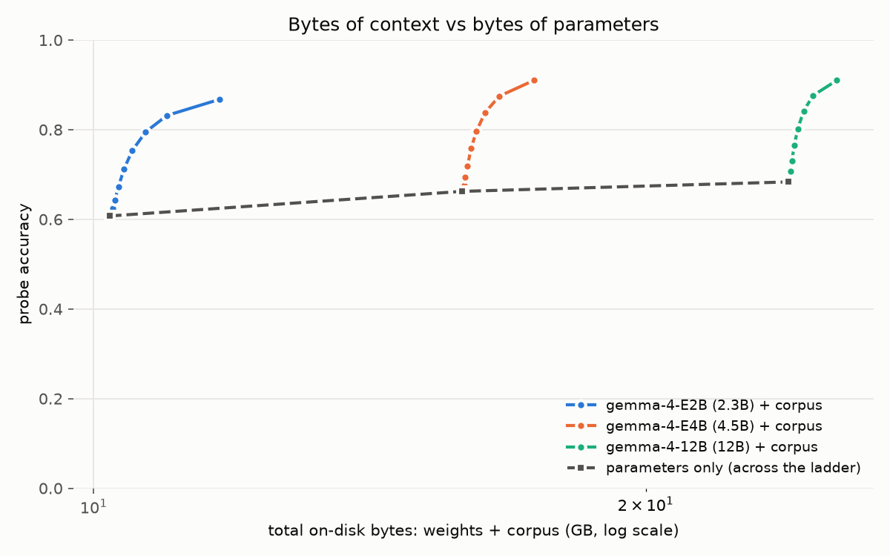

# Ballast: Quantize the Weights, Ballast the Knowledge

*OpenBallast — working notes, v0.2 (August 2026). Numbers below are measured, not projected; the experiment matrix is still running and this document will be updated as verdicts land.*

---

## 1. Thesis

**Parameters are the most expensive place to store facts.**

A language model's weights conflate two different things: a *reasoning engine* and a *knowledge inventory*. Modern small models (2–4B) have surprisingly capable engines — they read, compose, and follow instructions well — but their inventories are hard-capped by parameter count (empirically ~2 bits of recallable fact per parameter; Allen-Zhu & Li, 2024), and long-tail facts are precisely what scaling struggles to buy (Kandpal et al., 2023). Every method labs use to make small models — smaller pretrains, distillation (Hinton et al., 2015), pruning, nested elastic architectures (Devvrit et al., 2023) — compresses the engine efficiently and *loses the tail of the inventory by construction*.

The community's verdict on small models ("brain damaged," "unusable") is mostly a knowledge complaint wearing a general verdict. Our first measurement makes the split visible: **Gemma-4-E2B answers 60.8% of factual probes from its weights, and 86.8% when handed compact evidence it has never seen** — the capability to *use* facts is present; the facts are not.

So the claim: knowledge should ship as a **separate, versioned, compressed, quantizable artifact** — a *ballast* — that any model loads next to its weights:

- **~40–100× cheaper per fact than full-precision parameters** (measured below; ~40× with the measured real-world linker, §4.7, and ~15× if the larger model is charged at its cheapest intact quant, §4.2),
- stored in flash/RAM instead of VRAM (~1000× cheaper medium at rest; retrieved evidence still spends context tokens at inference, §4.7),
- updateable monthly without retraining anything,
- quantizable in nested levels like weight quants (pick your L2 like you pick your Q4 — with the caveat that levels truncate the tail rather than reduce precision, §2),
- CC0, rebuilt from public dumps (build tooling to be open-sourced — §6).

One sentence: **quantize the weights, ballast the knowledge.**

### 1.1 What's borrowed, what's new

The core mechanism — augmenting a parametric model with an external datastore at
inference time — is the semiparametric/retrieval-augmented line: kNN-LM
(Khandelwal et al., 2020), REALM (Guu et al., 2020), RAG (Lewis et al., 2020),
RETRO (Borgeaud et al., 2022), Atlas (Izacard et al., 2022). RETRO and Atlas in
particular established that a small model plus retrieval can match a much larger
one. Mallen et al. (2023) established the specific fact this project leans
hardest on: parametric memory tracks entity *popularity*, retrieval helps
exactly where popularity runs out — and can even *hurt* at the head, which is
why selection (not just retrieval) is the interesting problem.

The packaging idea follows two existing format precedents. Weights have **GGUF**
(llama.cpp; Gerganov et al.): one file, quantization levels, works everywhere.
Offline reading has **ZIM** (openZIM/Kiwix), which spent two decades proving a
reference corpus can ship as one portable, versioned, offline artifact.
Knowledge for models has no equivalent — every retrieval corpus is a bespoke
pipeline and somebody's Docker Compose file. Ballast is an attempt at that
missing third format, and takes the artifact model directly from those two.

The compression and access layer is borrowed whole from the data-engineering
stack: **Apache Parquet** columnar storage under **zstd** compression (Collet &
Kucherawy, RFC 8878), **Hive-style partitioning** (Thusoo et al., 2009) — which
is what makes levels real: buckets are directory prefixes any engine prunes
without reading, so truncation happens at download time — and **DuckDB**
(Raasveldt & Mühleisen, 2019) as the in-process query engine, so the artifact is
readable on a laptop or an edge worker with zero servers. None of that is ours;
the contribution is noticing this stack is the right shape for quantizable model
knowledge.

What this project adds is artifact discipline on top of that literature: the
datastore as a *versioned, CC0, standalone release* rather than a lab-internal
index; nested rank-bucket **levels** that make knowledge/bytes a user-facing
knob analogous to weight quants; a measured **corpus-bytes vs parameter-bytes
exchange rate** on one probe set across model sizes and weight quants; and a
measured verdict on per-model **tuned ballasts** selected by a competence model
(negative — generic selection wins at equal bytes, §4.8). The numbers below
measure those additions, not retrieval augmentation per se.

## 2. The artifact

**Ballast T0** is the reference artifact: cleaned Wikidata (Vrandečić & Krötzsch, 2014) triples, published as hive-partitioned Parquet. Canonical distribution: [huggingface.co/datasets/OpenBallast/ballast-t0](https://huggingface.co/datasets/OpenBallast/ballast-t0).

| property | value |
|---|---|
| entities | 25.4M (every Wikidata item with a resolvable label, minus Wikimedia-internal pages) |
| triples | 197.4M statements (external-identifier, media, and URL datatypes excluded at publish) |
| properties | 13,704 (labels shipped with every level) |
| published size | **1.51 GB** (zstd parquet; 8.67 GB as raw TSV) |
| license | CC0 (Wikidata) |
| layout | `entities/…/rank_bucket=k/`, `triples/…/rank_bucket=k/`, `properties.parquet`, `manifest.json` |

### Corpus quantization

Entities are ranked by a composite of notability signals (log sitelinks + log claim count) and assigned to **8 nested rank buckets** at fractions 0.5%, 1%, 2%, 4%, 8%, 16%, 32%, 100%. A *level* Lk is the union of buckets 0..k — a byte-budget prefix of the corpus:

| level | cumulative size | contains |
|---|---|---|
| L0 | 36 MB | top 0.5% of entities |
| L1 | 62 MB | top 1% |
| L2 | 107 MB | top 2% |
| L3 | 179 MB | top 4% |
| L4 | 288 MB | top 8% |
| L5 | 466 MB | top 16% |
| L6 | 756 MB | top 32% |
| L7 | 1,507 MB | everything |

Truncation is not a filter — deeper buckets are simply never downloaded. It degrades evidence honestly in two ways: a subject outside the cutoff has no evidence at all, and a triple whose *object* entity falls outside the cutoff is dropped rather than rendered as a bare Q-id. Both behaviors are preserved end-to-end, including in the demo endpoint.

## 3. Methodology

### 3.1 Probes

Knowledge is measured by **logprob choice scoring**: for each question, score the length-normalized answer logprob of the gold answer against 7 type-matched distractors under the same prompt; prediction = argmax; confidence = softmax mass on the argmax. No generation, no judge model. This is the standard multiple-choice evaluation protocol from GPT-3-era benchmarking (Brown et al., 2020) as implemented in lm-evaluation-harness (Gao et al., 2023); probing knowledge via KB-triple-derived questions goes back to LAMA (Petroni et al., 2019). Abstention threshold 0.5 on candidate probability yields the triad *(correct / hallucinated / not attempted)*, adopting SimpleQA's grading taxonomy (Wei et al., 2024) — hallucination rate = wrong per attempt.

Probe set: **50,147 questions** across PopQA (Mallen et al., 2023), a self-generated Wikidata benchmark (rank-stratified, uncontaminated by construction), SimpleQA (Wei et al., 2024), Natural Questions (open; Kwiatkowski et al., 2019), and TriviaQA (Joshi et al., 2017) — the latter three entity-linked to the corpus by normalized label/alias match. Full corpus grounds 90.5% of subjects; of grounded probes, 97.7% carry the gold answer inside the rendered evidence block (instrumented per probe, not assumed).

### 3.2 The two-pass composition trick

The rate–distortion curve wants accuracy at every level, but a probe's evidence at cutoff k is determined by its subject's bucket. So **two GPU passes per model** (no corpus, full corpus) determine every point *exactly*:

```
accuracy(Lk) = mean_i [ grounded_i  if bucket(subject_i) ≤ k  else ungrounded_i ]
```

The one approximation — evidence content also thins under truncation — is checked, not assumed: re-running a 1,000-probe subsample with evidence physically rendered at each cutoff agrees with the composition to ≈0.002 accuracy. This trick is why the whole experiment matrix fits on one 32 GB workstation card: every corpus level, selection scheme, and budget arm is arithmetic over two passes.

### 3.3 The matrix

Three ways to spend bytes on knowledge — parameter count, parameter precision, corpus — measured on one probe set:

- **Size ladders at bf16**: Gemma-4 E2B / E4B / 12B; Qwen3.5 0.8B / 2B / 4B / 9B.
- **Gemma span at nf4** including the 31B (the only quant where it fits 32 GB), kept on its own axis so nf4 damage is never silently compared to bf16.
- **Quant sweep** on pivots (Gemma-4 E4B, 12B; Qwen3.5 4B, 9B): bf16 / fp8 / nf4 (Dettmers et al., 2023) / Q6_K / Q4_K_M (llama.cpp GGUF K-quants; Gerganov et al.) — GGUF K-quants scored via dequantization so the quantization error is preserved verbatim while deployment bytes are charged at the .gguf size. No public *base* K-quants exist for either family, so all GGUFs are self-converted from the base checkpoints; the Qwen3.5 ones additionally need a hand-written reverse of llama.cpp's conversion (transformers has no `qwen35` GGUF architecture), verified by tensor-wise roundtrip before use.

### 3.4 Model-aware ballast (the boost design)

Beyond the generic level prefix, a **competence model** per (model, quant) cell predicts P(model already knows | entity) from corpus-native features (rank, sitelinks, claim count). That such prediction should work at all is prior art: parametric knowledge tracks entity popularity (Mallen et al., 2023; Kandpal et al., 2023), and models' self-knowledge is itself well-calibrated (Kadavath et al., 2022) — we use external corpus features rather than model introspection so selection can run without GPU passes. The competence model is fit on half the probes (split by subject hash), evaluated on the other half, with a hard gate: if the model can't rank its own misses better than AUC 0.58, selection would be noise and the arm is abandoned. Four selection arms per model pair: **generic** (rank prefix), **profile** (weight by predicted ignorance), **delta** (weight by what a reference model knows and this one doesn't), **oracle** (identity-keyed ceiling, fit-side only). Selected corpora are written as *real artifacts* with label closure (every referenced object keeps its label row), so composition stays exact.

### 3.5 Beyond recall

A second probe family tests whether ballast reduces hallucination when copy-extraction cannot work: 2-hop composition chains whose answer appears only via a join (with an adversarial subset where the competing join path's answer is also present in evidence — distractor-in-context stress in the spirit of Shi et al., 2023), unanswerable/false-premise probes where every candidate is false (fabrication = any confident pick; the unanswerable-question design follows SQuAD 2.0, Rajpurkar et al., 2018, and false-premise framing follows FreshQA, Vu et al., 2023), 2WikiMultiHopQA (Ho et al., 2020), and TruthfulQA MC1 (Lin et al., 2022) as a falsification control — misconception-driven questions that grounding should *not* improve; if it does, gains are prompt artifact. Verdicts: §4.10.

## 4. Numbers so far

### 4.1 The ladder, raw vs ballasted (bf16, 50,147 probes, abstention 0.5)

| model | raw accuracy | + full ballast (1.51 GB) | hallucination raw → ballasted |
|---|---|---|---|
| Gemma-4-E2B | 0.608 | **0.868** | 0.242 → **0.074** |
| Gemma-4-E4B | 0.662 | **0.910** | 0.197 → 0.042 |
| Gemma-4-12B | 0.683 | **0.910** | 0.207 → 0.049 |

Grounded ceilings compress (E4B ≈ 12B once ballasted); raw floors spread. Generations differ in what they know far more than in what they can read.

### 4.1b Second family: Qwen3.5 (bf16, same probes)

| model | raw accuracy | + full ballast (1.51 GB) | hallucination raw → ballasted |
|---|---|---|---|
| Qwen3.5-0.8B | 0.324 | **0.784** | 0.601 → **0.114** |
| Qwen3.5-2B | 0.363 | 0.770 | 0.552 → 0.137 |
| Qwen3.5-4B | 0.434 | **0.831** | 0.474 → **0.095** |
| Qwen3.5-9B | 0.542 | 0.819 | 0.329 → 0.113 |

The pattern replicates across an unrelated family, and sharpens: raw floors
spread 0.32–0.54 while grounded ceilings land in a 0.77–0.83 band — and the
**ballasted 4B beats the ballasted 9B outright** (0.831 vs 0.819). Crossings:
0.8B + 62 MB (L1) exceeds the 4B raw (0.443 vs 0.434); 0.8B + 180 MB (L3)
exceeds the 9B raw (0.552 vs 0.542) — both at ideal entity resolution (§4.7;
the realization band was measured on the Gemma family) and on margins of
~0.01. The parameter route to that gain is ~16 GB of bf16 weights, a ~90×
byte disadvantage. The 0.8B's hallucination rate
falls more than 5× (0.601 → 0.114). Families do differ in grounded ceiling
(Gemma ~0.91 vs Qwen ~0.82 on the same evidence) — reading ability varies
across lineages — but the within-family structure (floors spread, ceilings
compress, head-heavy value-per-byte) is identical.

### 4.2 Equal-bytes crossings — the headline

*(Ideal entity resolution; the realized band is §4.7.)*

| comparison | corpus route | parameter route | byte advantage |
|---|---|---|---|
| E2B reaches E4B's raw accuracy | **+110 MB** of ballast (L2: 0.672 > 0.662) | +2.2B params ≈ 4.4 GB bf16 | **~40×** |
| E2B reaches 12B's raw accuracy | **+180 MB** of ballast (L3: 0.712 > 0.683) | +9.7B params ≈ 19.4 GB bf16 | **~100×** |
| E2B@nf4 reaches 31B@nf4's raw accuracy | **+466 MB** of ballast (L5: 0.769 > 0.732) | +28.7B params ≈ 16.3 GB nf4 | **~35×** |

The last row is the ladder top, added once the 31B cell became runnable
(§4.6): **a 2.3B model carrying 466 MB of corpus beats a 31B model on 7.2 GB
of total footprint against 17.8 GB** — the same crossing as the first two
rows, now against a model 13× its size and priced at nf4 on both sides rather
than against full-precision weights.



*Each solid line is one model spending additional bytes on corpus; the dashed line is the same budget spent on parameters instead. Corpus spend is near-vertical at this scale — the crossings in the table are visible as each small model's line climbing past the larger models' starting points.*

Pricing note: the parameter route above is charged at bf16. §4.6 shows the 12B
rides Q4_K_M nearly intact (raw 0.673 vs 0.683), so the cheapest honest
parameter route is ~7.3 GB on disk — against which the full-corpus advantage
is roughly 15× at the realized retrieval floor (§4.7). The 40–100× figures
hold against full-precision weights; both pricings are stated so the
comparison never rests on the flattering one.

### 4.3 Rate–distortion is smooth and concave

Marginal value per gigabyte falls ~14× from the head of the corpus to the tail (E2B: 0.71 accuracy-points/GB at L1 → 0.05 at L7), with the same shape across model sizes. Truncation is a real quality knob — graceful degradation, no cliff — which is what makes corpus quantization levels meaningful.

### 4.4 The boundary is predictable (boost precondition)

Competence models hit **AUC 0.774 (E2B), 0.807 (E4B), 0.807 (12B)** on held-out subjects against a 0.58 gate — each model's knowledge holes are strongly predictable from corpus-native features alone. Model-aware tuned ballasts therefore have signal
to exploit — yet the measured verdict (§4.8) is that selection built on this
signal loses to the generic prefix at equal bytes: predictable ignorance
without demand-awareness is not enough.

### 4.5 Live replication

The entire loop runs end-to-end on consumer hardware: a 16 GB desktop GPU holding both Gemma members, grounded by the corpus served from a free-tier edge endpoint. First 4-probe tail-PopQA spot check through open-ended generation: raw **0/4 and 0/4**; ballasted **2/4 and 3/4** (both remaining misses are grader strictness, e.g. "Eastern Orthodox Christianity" vs gold "Eastern Orthodox Church"). The raw models hallucinate *differently* (London vs Surrey for Douglas Adams's birthplace); one ~440 ms edge lookup corrects both.

### 4.6 Weight quantization interacts — nf4 and the GGUF K-quants

Same ladder at nf4 (own axis, never silently compared to bf16):

| model @ nf4 | raw (Δ vs bf16) | + full ballast (Δ vs bf16) |
|---|---|---|
| Gemma-4-E2B | 0.587 (−0.021) | 0.842 (−0.026) |
| Gemma-4-E4B | 0.485 (**−0.177**) | 0.650 (**−0.260**) |
| Gemma-4-12B | 0.673 (−0.010) | 0.903 (−0.007) |
| Gemma-4-31B | 0.732 (no bf16 ref) | 0.934 (no bf16 ref) |

The 31B is the ladder top and runs only at nf4 — 17.8 GB of weights against a
32.6 GB card, with no bf16 reference possible on this hardware, so its row
carries no delta. It behaves like the 12B rather than the E4B: highest raw
floor (0.732) and highest ceiling (0.934) in the project, hallucination rate
0.146 → 0.031 under full ballast. Scale does not confer immunity to the
E4B-style cliff — E2B and 12B and 31B all ride nf4 while the 4.5B member
between them does not — but nothing at this size showed the failure.

The full pivot sweep (E4B, 12B at bf16 / fp8 / GGUF K-quants / nf4, ordered by
bits per weight) shows it as a dose-response:

| quant | bits/wt | E4B raw → ballasted | 12B raw → ballasted |
|---|---|---|---|
| bf16 | 16 | 0.662 → 0.910 | 0.683 → 0.910 |
| fp8 | 8 | 0.632 → 0.841 | 0.677 → 0.906 |
| Q6_K | ~6.6 | 0.655 → 0.908 | 0.681 → 0.910 |
| Q4_K_M | ~4.8 | 0.504 → **0.716** | 0.673 → 0.905 |
| nf4 | ~4.5 | 0.485 → **0.650** | 0.673 → 0.903 |


*The cliff, located: E4B (blue) is intact through Q6_K and collapses at the ~4-bit levels, on both its raw floor (dashed) and its ballasted ceiling (solid). 12B (orange) is flat everywhere. Note fp8 denting E4B's ceiling while the lower-bit Q6_K does not — format matters, not just bits.*


*The same cells as full curves. E4B's Q6_K (green) is indistinguishable from bf16 (blue, underneath it) at every corpus size; the two ~4-bit curves rise in parallel but never recover — a damaged reader gains from evidence at the same rate, from a permanently lower base. Every 12B curve coincides.*

The 12B's grounded ceiling is untouched across the entire sweep, K-quants
included (worst case 0.910 → 0.903). E4B's collapses with quantization depth —
but by format, not monotonically by bits: Q6_K at ~6.6 bits is
indistinguishable from bf16 on both floor and ceiling (0.655 → 0.908), while
fp8 at a full eight bits already dents the ceiling (0.841). At the ~4-bit
level both format families break E4B the same way — Q4_K_M 0.504 → 0.716,
nf4 0.485 → 0.650. The K-quant is marginally gentler, but the collapse class
is identical: for E4B the cliff edge sits between ~6.6 and ~4.8 bits
regardless of whether the quantizer is llama.cpp's K-quant blocks or
bitsandbytes nf4.

Two lessons. First, quantization damage is architecture-dependent, not
size-monotonic: E2B and 12B ride even Q4_K_M nearly free while E4B falls off
a cliff, and Q6_K is free on every cell measured here. Second — and the
important one for this thesis — when quantization damages the *engine*, ballast
cannot buy it back: E4B's grounded ceiling collapses along with its raw floor
under both 4-bit formats (0.716 at Q4_K_M, 0.650 at nf4), i.e. deep
quantization broke its ability to read evidence, and no amount of corpus
fixes a broken reader. The community's "Q4 made it unusable" experience and the
"Q4 is free" experience are both real; they happen on different models, and the
grounded ceiling is the diagnostic that tells them apart. Corollary: at nf4 the
*smaller* Gemma is strictly better once ballasted (0.842 vs 0.650), and
E2B@nf4 + full ballast — under 3 GB of total footprint — beats the raw
12B bf16 (0.842 vs 0.683 on ~24 GB) and, at 7.2 GB, the raw 31B@nf4 on
17.8 GB (§4.2).

### 4.6b Cross-family: the cliff is lineage-specific, the diagnostic is not

Everything above is one model family, so the same axis was run on Qwen3.5's
two nearest pivots (4B and 9B Base — the analogs of E4B and 12B). Q6_K and
Q4_K_M have no public *base* GGUFs and transformers has no `qwen35` GGUF
architecture mapping at all, so both were self-converted with llama.cpp and
loaded through a reverse mapping written for this project (roundtrip-verified
against the original weights tensor-by-tensor before any cell was scored;
worst relative error 4.5e-07, i.e. f16 rounding and nothing else).

| quant | bits/wt | Qwen3.5-4B raw → ballasted | Qwen3.5-9B raw → ballasted |
|---|---|---|---|
| bf16 | 16 | 0.434 → 0.831 | 0.542 → 0.819 |
| Q6_K | ~6.6 | 0.439 → 0.833 | 0.544 → 0.822 |
| Q4_K_M | ~4.8 | **0.437** → **0.775** | 0.523 → 0.804 |
| nf4 | ~4.5 | 0.426 → 0.815 | **0.507** → **0.826** |

**No E4B-style cliff appears in Qwen3.5.** Nothing here collapses: the worst
ceiling loss is 5.6 points, against E4B's 26. The catastrophic mode is a
property of that lineage, not of 4-bit quantization, and the honest scope of
§4.6 is "some models fall off a cliff, and you cannot tell which from size or
bit-count."

**What these four cells show instead is a double dissociation between recall
and reading.** The two bolded cells are mirror images:

- *Qwen3.5-4B at Q4_K_M* keeps its raw floor exactly (0.437 vs bf16 0.434 —
  inside noise, nominally higher) and loses 5.6 points of ballasted ceiling.
  Recall intact, reading damaged.
- *Qwen3.5-9B at nf4* loses 3.5 points of raw floor (0.507 vs 0.542) and its
  ballasted ceiling does not move at all (0.826 vs 0.819, nominally higher).
  Reading intact, recall damaged.

Each capability is damaged in one cell and spared in the other, so this is not
one underlying quantity measured two ways: **the ability to recall a fact from
weights and the ability to read a fact from context are separately damageable
by weight quantization.** That is the empirical basis for the whole thesis —
if the two were one capability, moving knowledge out of the weights could not
work — and it is also why the two measurements are not interchangeable in
practice. A raw benchmark sees the second cell's loss and calls the first
cell free; a grounded probe sees the opposite. Both are needed, and neither
substitutes for the other.

The 9B/nf4 cell is the thesis's mechanism in miniature: quantization deleted
memorized facts, ballast supplied them back, and the result matched the
unquantized model at ~28% of its weight bytes. That is "quantize the weights,
ballast the knowledge" running as a measurement rather than a slogan — but
note it is one cell out of eight, not a law.

**The format ranking inverts between families.** On Gemma-E4B, nf4 was the
worse of the two ~4-bit formats (ceiling 0.650 vs Q4_K_M's 0.716). On
Qwen3.5-4B it is the reverse, and by a factor of three: nf4 costs 1.6 ceiling
points, Q4_K_M costs 5.6. "K-quants are gentler than nf4" is therefore not a
fact about the formats — it is a per-model interaction, and one that only
appears in the grounded measurement.

**Q6_K is free in all six cells measured across both families** (four here,
two in §4.6), on both floor and ceiling, at ~2.4× the compression of bf16.
For the deployment question this thesis cares about, that is the practical
answer: quantize to Q6_K, spend the saved bytes on ballast, and verify with a
grounded probe rather than a raw one — because at the ~4-bit levels the
damage is real, model-specific, format-specific, and, in one direction,
invisible to the benchmark most people would run.

### 4.7 Realized retrieval — de-oracling the headline

*(Correction, 2026-08-01: an earlier version of this section reported that
wrong entity links were as harmful as right links were helpful, and on that
basis ranked precision-first linkers highest at ~34% realization. That harm
number came from a padding-misaligned scoring harness — caught within hours by
cross-checking against the banked per-probe passes — and reversed on
re-measurement. The corrected numbers below supersede it; the audit trail
lives in the research repo.)*

The matrix assumes perfect entity resolution. We measured what a real,
non-generative linker (capitalized-span mining + normalized name index)
actually realizes on the same 50,147 probes, and priced its failure modes
directly:

- A linked probe resolving to the **right** entity realizes that probe's
  grounded outcome (+17 accuracy points on the hit slice, hallucination
  halved). A **miss** links nothing and falls back to ungrounded — free.
- A **wrong link** attaches a homonym's facts, and — measured on a dedicated
  GPU pass over 1,025 wrong-linked probes — is **approximately neutral**
  (accuracy 0.311 → 0.325): the model largely ignores evidence irrelevant to
  the question. Hedged framing ("may be unrelated — ignore if so") changes
  nothing in either direction.
- Because wrong links are cheap and misses forgo gain, **hit-rate is the
  objective**, and recall machinery pays. Composing per-probe over seven
  linker variants (E2B bf16, wrong links conservatively scored as exactly
  neutral): the naive precise linker realizes **52%** of the oracle gain;
  adding context disambiguation, lowercase fallback mining, and FTS5 fuzzy
  matching lifts the band to **63–66%**. The shipped CLI and demo endpoint run
  a mid-band configuration (~63%).

**What the floor does to the headline crossings — stated plainly.** At ~63%
realization, E2B + the full 1.51 GB ballast lands at ≈0.77 end-to-end against
the 12B's raw 0.683 — the full-corpus crossing holds comfortably. The sharper
oracle claim "E2B + 180 MB beats the 12B raw" moves to **E2B + ~470 MB (L5)**
at the realized floor (L3 composes to ≈0.67, just under; L5 to ≈0.71). The
byte advantage versus the ~19.4 GB bf16 parameter route remains ~40× — ~15×
if the 12B is instead charged at Q4_K_M, the cheapest quant that leaves it
intact (§4.6). Two further
qualifications, in opposite directions: the probe setting — mining mentions
from raw natural-language trivia — is close to worst-case retrieval, and the
agent path (the model calls `resolve("Douglas Adams")` with a clean mention,
resolved at ~88%) sits near the ceiling, not the floor; conversely, these
compositions inherit the harm sample's CIs and the probe set's popularity mix.

This turns the former "oracle retrieval" caveat into a measured band: the
corpus's value is the ceiling, a weekend-grade linker holds about two thirds
of it, and the remaining gap is an engineering ladder (typed disambiguation,
retrieval-quality levels R0–R7) with a per-rung measurement in place — not an
assumption.

### 4.8 Model-aware selection: a negative result with a measured ceiling

The boost design (§3.4) asked whether a corpus selected for a specific model
beats the generic notability prefix at equal bytes. For the E2B→E4B pair, it
does not:

- **Generic selection alone crosses the target**: the rank prefix closes 103%
  of the E2B→E4B raw gap at L2 (107 MB) and 395% at the full corpus — the
  "boost past the larger model" effect needs no model-awareness at all.
- **Both tuned arms lose to generic at every equal-bytes level** (profile:
  Δ −0.013…−0.137; delta: Δ −0.013…−0.131; McNemar p ≈ 0 throughout). The
  result is decisive, not marginal.
- **The oracle ceiling is nonetheless enormous**: an identity-keyed selection
  of the 1,885 entities the model actually misses closes 213% of the gap in
  0.9 MB — three orders of magnitude less than the generic corpus needs.

**It replicates on two further arms, chosen to stress it in opposite
directions.** *E2B→31B* is the widest capability gap in the ladder (+0.143 on
the EVAL split): generic closes 156% of it at full corpus, the tuned arm 141%,
and tuned loses at every equal-bytes level (Δ −0.014…−0.131, McNemar p ≈ 0).
*12B@Q4_K_M→12B@Q6_K* is the **quant-damage buyback** arm — can targeted
ballast repurchase what quantization deleted? — and it fails the same way
(Δ −0.009…−0.109, p ≈ 0). Three arms, spanning a 0.9-point gap and a
14-point one, all decisively negative: the result is not an artifact of the
pair it was discovered on.

The buyback arm carries a second number worth stating on its own. The gap it
is trying to close is tiny — 12B loses only 0.9 points to Q4_K_M (§4.6) —
while the generic corpus adds ~20 points on top, so generic ballast overshoots
the quantization damage by **~24×** (gap_closed 23.7 at full corpus). The
practical reading: for a model that rides its quant cleanly, worrying about
recovering quantization loss is the wrong frame entirely. The corpus dwarfs
it.

The failure mechanism is visible in the coverage column: at L0 the tuned
selection grounds 1.5% of probe subjects against the generic prefix's 20.4%.
Every ingredient of tuned selection works in isolation — competence models
pass their gates on every cell (AUC 0.66–0.81, §4.4), and miss-sets are
genuinely model-specific (§4.9) — but the selection objective is *expected
query mass × predicted ignorance*, and corpus-native features estimate only
the second factor. Predicted ignorance concentrates in the deep tail, where
per-entity query mass is smallest; buying it evicts head entities that the
query distribution actually touches. The oracle succeeds precisely because
identity keys encode the query distribution. Stated in the terms of §1.1:
parametric knowledge tracks popularity and is therefore predictable from
corpus structure, but *demand* — which facts get asked — is a property of the
query distribution, not the corpus, and no function of corpus-native features
recovers it. This sharpens, rather than contradicts, the selection problem
Mallen et al. (2023) pose: knowing *where the model is ignorant* is not
sufficient; selection needs an independent estimate of what will be asked.

Scope note: this verdict is relative to the benchmark-derived query
distribution of the probe set. A query distribution concentrated in the deep
tail would shift the comparison; the oracle row bounds how much.

### 4.9 Miss-set overlap: knowledge holes are lineage-specific

Cohen's κ between miss indicators (beyond accuracy-marginal chance), 41,381
shared probes:

- **Cross-family κ 0.27–0.55** vs within-family 0.67–0.90. On 39% of probes,
  Qwen3.5-0.8B misses what Gemma-4-12B knows; the converse set is 2.5%.
  Different training mixtures leave substantially different holes.
- **Weight quantization preserves the miss-set**: same-model pairs at
  different quants agree at κ 0.84–0.90 — quantization mostly shrinks
  knowledge along the same frontier rather than moving it.
- **Except Gemma-4-E4B at nf4**: κ 0.54 against its own bf16 — nf4 does not
  merely shrink E4B's knowledge, it *scrambles* it. This is a third
  independent signature of the §4.6 cliff (after the raw floor and the
  grounded ceiling).

Together with §4.8 these two results form a consistent picture: holes are
model-specific and predictable, yet a single generic corpus serves every
model measured here better than corpora tuned to each — because the generic
ranking already approximates the one quantity tuning cannot observe.

### 4.10 Hallucination beyond recall: composition falls, fabrication rises

The §3.5 probe families, run over twelve (model, quant) cells (E2B/E4B/12B at
bf16; E4B/12B at fp8, nf4, and GGUF Q6_K/Q4_K_M; 31B at nf4), 43,137 probes
per cell, logprob MC with the abstention triad at threshold 0.5. Hallucination rate = wrong answers per
attempt; each family read at every corpus cutoff (dose–response, as §4.6).

**Composition (hop2, adversarial hop2, 2WikiMultiHopQA): PASS in all 36
family×cell readings.** Where copy-extraction cannot work — the answer exists
only through a join across two evidence lines — grounding still collapses
hallucination: hop2 0.34–0.49 ungrounded → 0.006–0.24 at full corpus;
2WikiMultiHopQA 0.42–0.67 → 0.08–0.42. The adversarial subset (the competing
join path's answer is also present in evidence, distractor-in-context in the
spirit of Shi et al., 2023) costs a few points but does not change the
verdict (12B bf16: 0.42 → 0.05). The fall is monotone in corpus level in
every cell — a dose–response curve, not an endpoint artifact. E4B@nf4 is
again the weakest cell (adversarial 0.61 → 0.44; 2WikiMultiHopQA 0.67 →
0.42), and E4B@Q4_K_M is its sibling (hop2 recovery stalls at 0.25;
2WikiMultiHopQA 0.68 → 0.46): fourth and fifth appearances of the §4.6 cliff
signature, now in hallucination rather than recall. E4B@Q6_K meanwhile
matches bf16 exactly (hop2 → 0.006) — the quant axis reproduces its §4.6
shape wholesale in hallucination space. At the other end, the 31B@nf4 posts
the lowest composed-hallucination rates measured anywhere in this project
(hop2 0.307 → **0.002**, adversarial 0.403 → 0.011): the ladder top with a
full corpus is wrong on roughly one composed question in 400.

**Unanswerable/false-premise: FAIL in all 12 cells — fabrication *rises* with
grounding.** Every candidate answer to these probes is false; any confident
pick is a fabrication. Ungrounded, models abstain often (fabrication
0.18–0.27). With evidence present, fabrication climbs — monotonically with
coverage, roughly linearly (12B bf16: 0.243 ungrounded → 0.256 at L0 → 0.406
at full corpus; +0.07 to +0.18 across cells). The mechanism is abstention
suppression: an evidence block that mentions the question's entities — while
containing no answer, because none exists — reads as license to answer.
Grounding transfers trust from the model's calibration to the context, and
that transfer is indiscriminate: it suppresses exactly the abstentions that
were correct. This is the retrieval-augmentation failure mode Shi et al.
(2023) observe for irrelevant context, appearing here for *relevant but
non-answering* context, and it is the strongest argument measured so far
that evidence injection needs an answerability signal (or verifier pass) —
already noted as out of scope for v1 in §6.

**TruthfulQA control: imperfect.** The control demands |Δ| ≤ 0.02 under
grounding; 3 of 12 cells pass, 9 move by up to ±0.07 (coverage 0.56 — half
the items link to corpus entities). The sign is inconsistent across cells, so
this is not a systematic prompt artifact inflating the headline results, but
the control cannot certify them either at the 2% margin: evidence injection
measurably perturbs behavior on misconception-style questions. Read the
composition PASSes with that grain of salt; the unanswerable FAIL needs no
control (it is a negative result against the intervention).

The pairing is the finding: the same evidence block that cuts multi-hop
hallucination by 3–20× also *raises* unsupported-answer rate by half to
three-quarters when no true answer exists. Grounding, as implemented here, is
not a hallucination fix — it is a trade of one failure mode against another,
strongly favorable only when questions have answers.

**Feasibility of the answerability signal (measured).** The signal the
failure calls for may already live in the artifact: *subject covered but
queried relation absent* — absence as evidence, a locally-applied closed-world
check. On the relation-structured probe subset (23,901 grounded probes with
resolvable property ids), that check false-fires on only **0.6–0.8% of
answerable questions**, flat across subject-density terciles and all eight
rank buckets — for core relations, Wikidata is near-closed-world wherever the
subject exists at all. Per-relation false-alarm runs 0% (country, birthplace,
occupation) to 3% (author). When it does false-fire, 79% of those evidence
blocks still contain the gold via another rendering and the model answers
84.5% of them correctly anyway — so a *warn-don't-suppress* policy on
relation absence addresses the fabrication failure at near-zero cost to
answerable traffic. It fires on 100% of the unanswerable probes, but that
number is circular (the family was constructed from Wikidata absence) and
does not transfer to open-domain false premises; the false-alarm rate is the
genuine measurement. One line of evidence-block metadata, computable at
retrieval time from the artifact alone.

## 5. Honest caveats

- **Retrieval realization is a band, not a point**: matrix numbers are the
  perfect-resolution ceiling; the measured non-generative linker realizes ~63%
  of the grounding gain end-to-end (§4.7). Retrieval-side improvements move
  within that band without touching the artifact.
- **Coverage cap**: the corpus grounds 90.5% of probe subjects; the remainder bounds grounded accuracy.
- **Abstention-thresholded metrics**: raw forced-choice gaps are smaller than triad numbers.
- **Contamination**: models have seen Wikipedia/Wikidata in pretraining. The self-generated benchmark is uncontaminated by construction; external sets serve as robustness checks; and the interesting quantity (grounded − ungrounded delta) is contamination-*conservative* — pretraining exposure inflates the raw floor, not the gain.
- **Generative grading** (demo bench) is weaker than logprob scoring — demo readout, not measurement.
- **Grounding suppresses correct abstention**: on unanswerable probes,
  fabrication rises monotonically with corpus coverage (§4.10). Evidence
  injection without an answerability signal trades multi-hop hallucination
  for false-premise fabrication.
- **The TruthfulQA control is not clean**: 4 of 7 cells move beyond the 2%
  margin (±0.03–0.07, inconsistent sign) under grounding (§4.10).
- **Quant damage does not have one shape**: across two families and four
  pivots it appears as total collapse (E4B at 4-bit), proportional shrinkage
  (Qwen-9B at Q4_K_M), reading-only loss with an intact raw floor (Qwen-4B at
  Q4_K_M), recall-only loss that ballast fully repairs (Qwen-9B at nf4), or
  nothing at all (every Q6_K cell) — and which one you get is not predictable
  from size, bit-count, or format alone (§4.6, §4.6b). Any deployment claim
  about a specific quant should be measured on that model, with both a raw
  and a grounded probe.
- Facts absent from Wikidata are absent from the ballast; T0 measures the triple-shaped slice of knowledge.

## 6. What's running now / next

- Qwen3.6-27B quant cells: nf4 and NVFP4 on the reference box; fp8, bf16 and
  the K-quants need ≥54 GB of VRAM (§4.6b footnote) and run elsewhere.
  (All three boost arms — E2B→E4B, E2B→31B, quant-damage buyback: measured,
  §4.8.)
- Hallucination-family cells for the Qwen3.5 quant pivots (does the
  reading-damage mode of §4.6b also move the §4.10 curves). (Matrix cells:
  done, §4.6b.)
- Gemma-4-31B; cross-family miss-set overlap — if families miss *different* facts, a shared ballast is worth more than either family's tuning. (Qwen3.5 ladder: done, §4.1b. Overlap: done, §4.9.)
- Legacy revival cells (Mistral-7B-class): grounding as a generation equalizer.
- Tooling for third parties to build and tune their own ballasts (to be open-sourced separately).

## 7. Where things live

| surface | role |
|---|---|
| [huggingface.co/OpenBallast](https://huggingface.co/OpenBallast) | **canonical artifacts** — the T0 corpus and eval sets, versioned |
| [github.com/OpenBallast/ballast-cli](https://github.com/OpenBallast/ballast-cli) | **local tooling** — `ballast pull/serve`: OpenAI grounding proxy + MCP server over the corpus, offline |
| [mcp.openballast.org](https://mcp.openballast.org) | live **demo endpoint** (MCP + HTTP) — levels L0–L5 served from a $0/month free-tier stack |
| [github.com/OpenBallast](https://github.com/OpenBallast) | docs, spec, this document |
| [openballast.org](https://openballast.org) | landing |

Data: Wikidata contributors, CC0.

## 8. References

- Allen-Zhu, Z. & Li, Y. (2024). *Physics of Language Models: Part 3.3, Knowledge Capacity Scaling Laws.* ICLR 2025. [arXiv:2404.05405](https://arxiv.org/abs/2404.05405)
- Apache Parquet. *Columnar storage format.* [parquet.apache.org](https://parquet.apache.org)
- Borgeaud, S. et al. (2022). *Improving Language Models by Retrieving from Trillions of Tokens* (RETRO). [arXiv:2112.04426](https://arxiv.org/abs/2112.04426)
- Collet, Y. & Kucherawy, M. (2021). *Zstandard Compression and the application/zstd Media Type.* [RFC 8878](https://www.rfc-editor.org/rfc/rfc8878)
- Brown, T. et al. (2020). *Language Models are Few-Shot Learners* (GPT-3). [arXiv:2005.14165](https://arxiv.org/abs/2005.14165)
- Dettmers, T. et al. (2023). *QLoRA: Efficient Finetuning of Quantized LLMs* (NF4). [arXiv:2305.14314](https://arxiv.org/abs/2305.14314)
- Devvrit et al. (2023). *MatFormer: Nested Transformer for Elastic Inference.* [arXiv:2310.07707](https://arxiv.org/abs/2310.07707)
- Gao, L. et al. (2023). *A framework for few-shot language model evaluation* (lm-evaluation-harness). [github.com/EleutherAI/lm-evaluation-harness](https://github.com/EleutherAI/lm-evaluation-harness)
- Gerganov, G. et al. *llama.cpp / GGUF quantization formats.* [github.com/ggml-org/llama.cpp](https://github.com/ggml-org/llama.cpp)
- Guu, K. et al. (2020). *REALM: Retrieval-Augmented Language Model Pre-Training.* [arXiv:2002.08909](https://arxiv.org/abs/2002.08909)
- Hinton, G., Vinyals, O. & Dean, J. (2015). *Distilling the Knowledge in a Neural Network.* [arXiv:1503.02531](https://arxiv.org/abs/1503.02531)
- Ho, X. et al. (2020). *Constructing A Multi-hop QA Dataset for Comprehensive Evaluation of Reasoning Steps* (2WikiMultiHopQA). [arXiv:2011.01060](https://arxiv.org/abs/2011.01060)
- Izacard, G. et al. (2022). *Atlas: Few-shot Learning with Retrieval Augmented Language Models.* [arXiv:2208.03299](https://arxiv.org/abs/2208.03299)
- Joshi, M. et al. (2017). *TriviaQA: A Large Scale Distantly Supervised Challenge Dataset for Reading Comprehension.* [arXiv:1705.03551](https://arxiv.org/abs/1705.03551)
- Kadavath, S. et al. (2022). *Language Models (Mostly) Know What They Know.* [arXiv:2207.05221](https://arxiv.org/abs/2207.05221)
- Kandpal, N. et al. (2023). *Large Language Models Struggle to Learn Long-Tail Knowledge.* [arXiv:2211.08411](https://arxiv.org/abs/2211.08411)
- Khandelwal, U. et al. (2020). *Generalization through Memorization: Nearest Neighbor Language Models* (kNN-LM). [arXiv:1911.00172](https://arxiv.org/abs/1911.00172)
- Kwiatkowski, T. et al. (2019). *Natural Questions: A Benchmark for Question Answering Research.* TACL 7. [doi:10.1162/tacl_a_00276](https://doi.org/10.1162/tacl_a_00276)
- Lewis, P. et al. (2020). *Retrieval-Augmented Generation for Knowledge-Intensive NLP Tasks* (RAG). [arXiv:2005.11401](https://arxiv.org/abs/2005.11401)
- Lin, S., Hilton, J. & Evans, O. (2022). *TruthfulQA: Measuring How Models Mimic Human Falsehoods.* [arXiv:2109.07958](https://arxiv.org/abs/2109.07958)
- Mallen, A. et al. (2023). *When Not to Trust Language Models: Investigating Effectiveness of Parametric and Non-Parametric Memories* (PopQA). [arXiv:2212.10511](https://arxiv.org/abs/2212.10511)
- openZIM contributors. *The ZIM file format* (Kiwix offline content archives). [openzim.org](https://openzim.org)
- Petroni, F. et al. (2019). *Language Models as Knowledge Bases?* (LAMA). [arXiv:1909.01066](https://arxiv.org/abs/1909.01066)
- Raasveldt, M. & Mühleisen, H. (2019). *DuckDB: an Embeddable Analytical Database.* SIGMOD 2019. [doi:10.1145/3299869.3320212](https://doi.org/10.1145/3299869.3320212)
- Rajpurkar, P., Jia, R. & Liang, P. (2018). *Know What You Don't Know: Unanswerable Questions for SQuAD* (SQuAD 2.0). [arXiv:1806.03822](https://arxiv.org/abs/1806.03822)
- Shi, F. et al. (2023). *Large Language Models Can Be Easily Distracted by Irrelevant Context.* [arXiv:2302.00093](https://arxiv.org/abs/2302.00093)
- Thusoo, A. et al. (2009). *Hive: A Warehousing Solution Over a Map-Reduce Framework.* VLDB 2(2). [doi:10.14778/1687553.1687609](https://doi.org/10.14778/1687553.1687609)
- Vrandečić, D. & Krötzsch, M. (2014). *Wikidata: A Free Collaborative Knowledgebase.* CACM 57(10). [doi:10.1145/2629489](https://doi.org/10.1145/2629489)
- Vu, T. et al. (2023). *FreshLLMs: Refreshing Large Language Models with Search Engine Augmentation* (FreshQA). [arXiv:2310.03214](https://arxiv.org/abs/2310.03214)
- Wei, J. et al. (2024). *Measuring Short-Form Factuality in Large Language Models* (SimpleQA). [arXiv:2411.04368](https://arxiv.org/abs/2411.04368)
