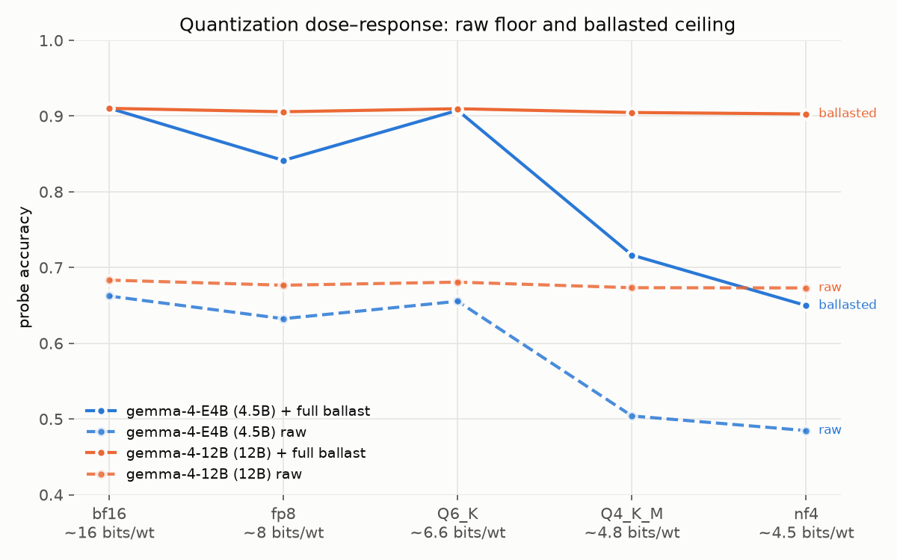
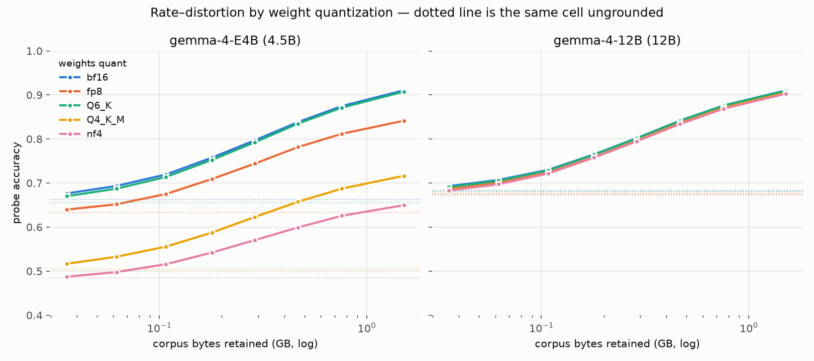
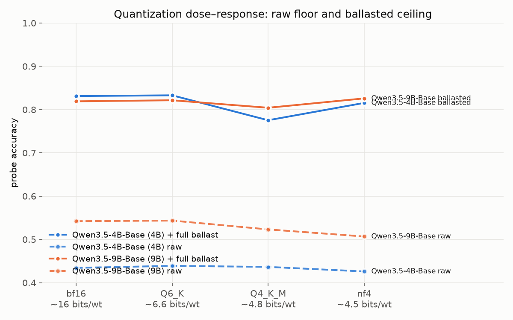
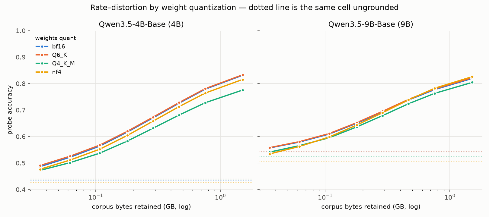
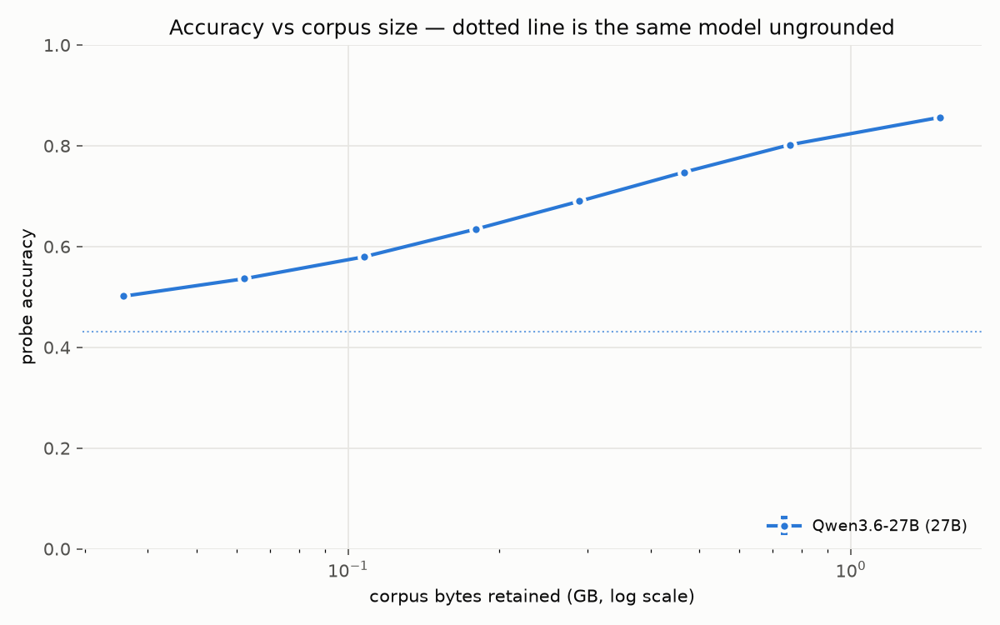

# Weight quantization: cliffs, dissociations, and the Q6_K verdict

*Part of the [OpenBallast working notes](../THESIS.md). Protocol: [methodology](methodology.md). The nf4 axis is kept separate so nf4 damage is never silently compared to bf16.*

## The nf4 ladder

| model @ nf4 | raw (Δ vs bf16) | + full ballast (Δ vs bf16) |
|---|---|---|
| Gemma-4-E2B | 0.587 (−0.021) | 0.842 (−0.026) |
| Gemma-4-E4B | 0.485 (**−0.177**) | 0.650 (**−0.260**) |
| Gemma-4-12B | 0.673 (−0.010) | 0.903 (−0.007) |
| Gemma-4-31B | 0.732 (no bf16 ref) | 0.934 (no bf16 ref) |

The 31B is the ladder top and runs only at nf4: 17.8 GB of weights against a 32.6 GB card, with no bf16 reference possible on this hardware, so its row carries no delta. It behaves like the 12B rather than the E4B: highest raw floor (0.732) and highest ceiling (0.934) in the project, hallucination rate 0.146 → 0.031 under full ballast. Scale does not confer immunity to the E4B-style cliff: E2B and 12B and 31B all ride nf4 while the 4.5B member between them does not, but nothing at this size showed the failure.

## Dose–response on the pivots

The full pivot sweep (E4B, 12B at bf16 / fp8 / GGUF K-quants / nf4, ordered by bits per weight):

| quant | bits/wt | E4B raw → ballasted | 12B raw → ballasted |
|---|---|---|---|
| bf16 | 16 | 0.662 → 0.910 | 0.683 → 0.910 |
| fp8 | 8 | 0.632 → 0.841 | 0.677 → 0.906 |
| Q6_K | ~6.6 | 0.655 → 0.908 | 0.681 → 0.910 |
| Q4_K_M | ~4.8 | 0.504 → **0.716** | 0.673 → 0.905 |
| nf4 | ~4.5 | 0.485 → **0.650** | 0.673 → 0.903 |

*The cliff, located: E4B (blue) is intact through Q6_K and collapses at the ~4-bit levels, on both its raw floor (dashed) and its ballasted ceiling (solid). 12B (orange) is flat everywhere. Note fp8 denting E4B's ceiling while the lower-bit Q6_K does not: format matters, not just bits.*

*The same cells as full curves. E4B's Q6_K (green) is indistinguishable from bf16 (blue, underneath it) at every corpus size; the two ~4-bit curves rise in parallel but never recover: a damaged reader gains from evidence at the same rate, from a permanently lower base. Every 12B curve coincides.*

The 12B's grounded ceiling is untouched across the entire sweep, K-quants included (worst case 0.910 → 0.903). E4B's collapses with quantization depth, but by format, not monotonically by bits: Q6_K at ~6.6 bits is indistinguishable from bf16 on both floor and ceiling (0.655 → 0.908), while fp8 at a full eight bits already dents the ceiling (0.841). At the ~4-bit level both format families break E4B the same way. Q4_K_M 0.504 → 0.716, nf4 0.485 → 0.650. The K-quant is marginally gentler, but the collapse class is identical: for E4B the cliff edge sits between ~6.6 and ~4.8 bits regardless of whether the quantizer is llama.cpp's K-quant blocks or bitsandbytes nf4.

Two lessons. First, quantization damage is architecture-dependent, not size-monotonic: E2B and 12B ride even Q4_K_M nearly free while E4B falls off a cliff. Second (and the important one for this thesis), when quantization damages the *engine*, ballast cannot buy it back: E4B's grounded ceiling collapses along with its raw floor under both 4-bit formats (0.716 at Q4_K_M, 0.650 at nf4), i.e. deep quantization broke its ability to read evidence, and no amount of corpus fixes a broken reader. The community's "Q4 made it unusable" experience and the "Q4 is free" experience are both real; they happen on different models, and the grounded ceiling is the diagnostic that tells them apart. Corollary: at nf4 the *smaller* Gemma is strictly better once ballasted (0.842 vs 0.650), and E2B@nf4 + full ballast (under 3 GB of total footprint) beats the raw 12B bf16 (0.842 vs 0.683 on ~24 GB) and, at 7.2 GB, the raw 31B@nf4 on 17.8 GB ([equal-bytes crossings](results-equal-bytes.md)).

## Cross-family: the cliff is lineage-specific, the diagnostic is not

Everything above is one model family, so the same axis was run on Qwen3.5's two nearest pivots (4B and 9B Base, the analogs of E4B and 12B). Q6_K and Q4_K_M have no public *base* GGUFs and transformers has no `qwen35` GGUF architecture mapping at all, so both were self-converted with llama.cpp and loaded through a reverse mapping written for this project (roundtrip-verified against the original weights tensor-by-tensor before any cell was scored; worst relative error 4.5e-07, i.e. f16 rounding and nothing else).

| quant | bits/wt | Qwen3.5-4B raw → ballasted | Qwen3.5-9B raw → ballasted |
|---|---|---|---|
| bf16 | 16 | 0.434 → 0.831 | 0.542 → 0.819 |
| Q6_K | ~6.6 | 0.439 → 0.833 | 0.544 → 0.822 |
| Q4_K_M | ~4.8 | **0.437** → **0.775** | 0.523 → 0.804 |
| nf4 | ~4.5 | 0.426 → 0.815 | **0.507** → **0.826** |

**No E4B-style cliff appears in Qwen3.5.** Nothing here collapses: the worst ceiling loss is 5.6 points, against E4B's 26. The catastrophic mode is a property of that lineage, not of 4-bit quantization, and the honest scope of the cliff result is "some models fall off a cliff, and you cannot tell which from size or bit-count."

**What these four cells show instead is a double dissociation between recall and reading.** The two bolded cells are mirror images:

- *Qwen3.5-4B at Q4_K_M* keeps its raw floor exactly (0.437 vs bf16 0.434, inside noise, nominally higher) and loses 5.6 points of ballasted ceiling. Recall intact, reading damaged.
- *Qwen3.5-9B at nf4* loses 3.5 points of raw floor (0.507 vs 0.542) and its ballasted ceiling does not move at all (0.826 vs 0.819, nominally higher). Reading intact, recall damaged.

Each capability is damaged in one cell and spared in the other, so this is not one underlying quantity measured two ways: **the ability to recall a fact from weights and the ability to read a fact from context are separately damageable by weight quantization.** That is the empirical basis for the whole thesis (if the two were one capability, moving knowledge out of the weights could not work), and it is also why the two measurements are not interchangeable in practice. A raw benchmark sees the second cell's loss and calls the first cell free; a grounded probe sees the opposite. Both are needed, and neither substitutes for the other.

The 9B/nf4 cell is the thesis's mechanism in miniature: quantization deleted memorized facts, ballast supplied them back, and the result matched the unquantized model at ~28% of its weight bytes. That is "quantize the weights, ballast the knowledge" running as a measurement rather than a slogan, but it is one cell out of eight, not a law.

Scope and fragility, before anyone builds on this: the dissociation rests on four cells, one prompt template, and self-converted GGUFs. The conversion is tensor-roundtrip-verified (worst relative error 4.5e-07), which proves the weights are faithful; it does not test whether the 3.5- and 5.6-point deltas survive a template or seed sweep, and quant results are notoriously sensitive to exactly that. Sampling noise is not the concern (at n = 50,147 per cell, binomial 95% intervals are under ±0.5 points, so both deltas clear it); protocol sensitivity is, and it is unmeasured. Strong evidence from one protocol; not a replicated law.

**The format ranking inverts between families.** On Gemma-E4B, nf4 was the worse of the two ~4-bit formats (ceiling 0.650 vs Q4_K_M's 0.716). On Qwen3.5-4B it is the reverse, and by a factor of three: nf4 costs 1.6 ceiling points, Q4_K_M costs 5.6. "K-quants are gentler than nf4" is therefore not a fact about the formats: it is a per-model interaction, and one that only appears in the grounded measurement.

**Q6_K is free in all six cells measured across both families** (four here, two on the Gemma pivots), on both floor and ceiling, at ~2.4× the compression of bf16. For the deployment question this thesis cares about, that is the practical answer: quantize to Q6_K, spend the saved bytes on ballast, and verify with a grounded probe rather than a raw one, because at the ~4-bit levels the damage is real, model-specific, format-specific, and, in one direction, invisible to the benchmark most people would run.

## A third family at the top: Qwen3.6-27B at nf4

The ladder top was re-run in a third lineage. Qwen3.6-27B is a hybrid linear-attention model that declares itself as the `qwen3_5` architecture, so it loads through the same reverse mapping written for the Qwen3.5 GGUF cells; at nf4 it is 17.3 GB of weights, and like the 31B it has no bf16 reference possible on a 32.6 GB card, so its row carries no delta. Same 50,147 probes, same protocol.

| model @ nf4 | params | raw | + full ballast | hallucination rate |
|---|---|---|---|---|
| Gemma-4-31B | 31B | 0.732 | 0.934 | 0.146 → 0.031 |
| Qwen3.6-27B | 27B | **0.430** | **0.857** | 0.516 → 0.089 |

**+42.7 points is the widest raw-to-ballasted span in the project**, wider than any Gemma cell and wider than the 0.8B Qwen3.5 (+46.0 is the one exception, at the opposite end of the size range). Half the span arrives cheaply: +34.1 of the +42.6 total gain is bought by `buckets 0-6`, i.e. 50.2% of the corpus bytes.

The interesting comparison is the pair above, because it isolates which capability lineage controls. Two models of near-identical size, both at nf4, differ by **30 points of raw floor** (0.430 vs 0.732), and read supplied evidence indistinguishably well. Restricted to probes whose evidence actually contained the gold answer, the 31B scores 0.967–0.996 across the ten popularity deciles and the 27B scores 0.957–0.991. The entire 30-point gap is recall; reading is near-saturated in both and essentially lineage-invariant. That is the same recall/reading split the Qwen3.5 double dissociation established through quantization damage, appearing here through pretraining differences instead, and it is the split ballast exploits, since a corpus can only substitute for the recall term.

Two confounds keep this from being a clean lineage verdict, and both cut the same way. Qwen3.6-27B is the instruction-tuned release (there is no `-Base` variant published), while every Qwen3.5 cell here is a base model, and base-vs-instruct is known to move closed-book MC probes on its own. Separately, the raw floor of a Qwen model on this template has run low throughout the project (Qwen3.5-9B bf16: 0.542), so part of the 30 points is template interaction rather than stored knowledge. The reading comparison is the robust half of the paragraph; the recall comparison is suggestive.

Because this cell is the first at this scale in a third architecture, the two-pass decomposition was re-validated here, not assumed. Re-rendering evidence at cutoffs 1 and 4 and rescoring from scratch reproduces the composed curve to **0.0015 and 0.0008** absolute: the composition trick holds on hybrid linear attention exactly as it does on the Gemma cells.

## A third signature: quantization can scramble, not just shrink

From the miss-set overlap analysis ([details](results-boost.md)): same-model pairs at different quants agree at κ 0.84–0.90. Quantization mostly shrinks knowledge along the same frontier rather than moving it. **Except Gemma-4-E4B at nf4**: κ 0.54 against its own bf16; nf4 does not merely shrink E4B's knowledge, it *scrambles* it. This is a third independent signature of the cliff, after the raw floor and the grounded ceiling.
